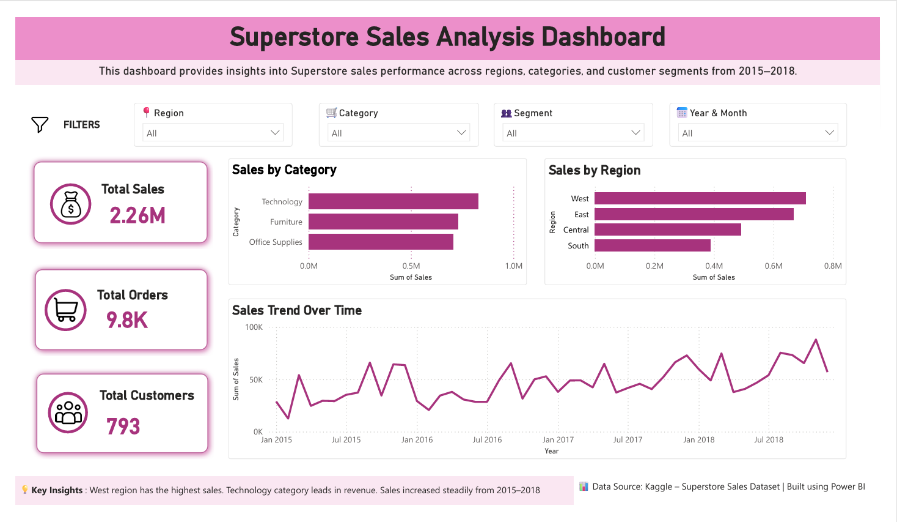
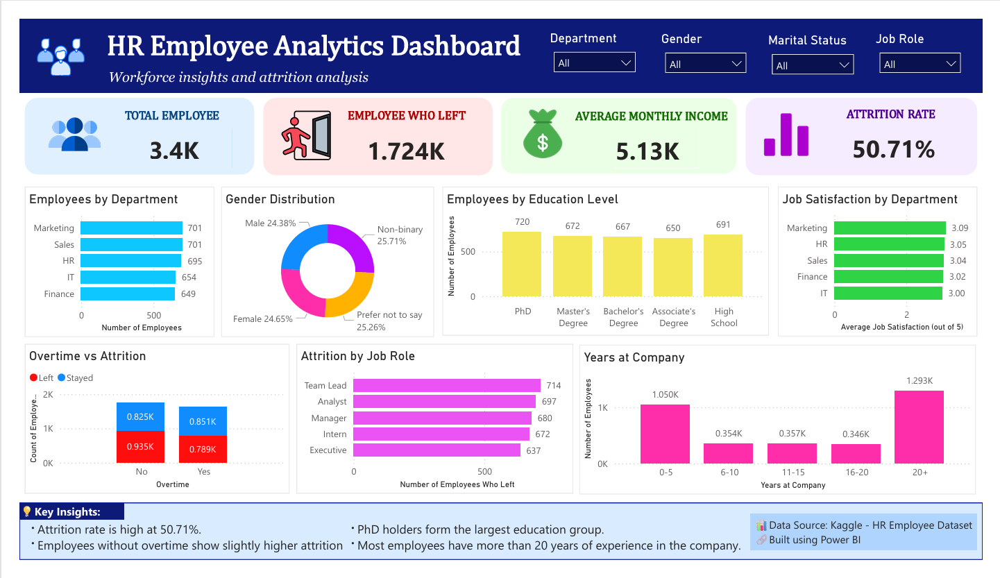

# Data Analytics Portfolio

This repository contains my data analytics dashboard projects created using Power BI.

## Projects

### 1. Superstore Sales Dashboard
Tools: Power BI, DAX

Project Overview
Developed an interactive sales analytics dashboard to monitor business performance across regions, product categories, and customer segments.

Key Insights & Features

- Analyzed sales performance across multiple regions to identify top-performing markets.
- Tracked monthly sales trends and seasonality patterns.
- Compared profitability and revenue across product categories.
- Designed KPI cards to monitor total sales, order volume, and customer count.
- Implemented interactive filters and drill-through functionality for deeper analysis.
- Enabled data-driven decision-making through real-time business performance visualization.

Dashboard Preview:

### 2. HR Analytics Dashboard
Tools: Power BI, DAX

Project Overview
Developed an HR analytics dashboard to analyze workforce demographics, employee retention, job satisfaction, and attrition trends, enabling data-driven HR decision-making.

Features

- Analyzed workforce data for approximately 3,400 employees across 5 departments.
- Evaluated employee attrition and turnover patterns, identifying 1,724 employee exits and an overall attrition rate of 50.71%.
- Examined employee distribution by department, education level, and gender demographics.
- Assessed employee tenure patterns and workforce experience levels.
- Analyzed job satisfaction across departments to evaluate employee engagement.
- Designed KPI cards to monitor total employees, attrition rate, employee exits, and average monthly income.
- Implemented interactive filters and drill-down functionality to enable detailed workforce analysis.

Key Insights

- The organization recorded a high attrition rate of 50.71%, indicating significant employee turnover.
- Marketing and Sales were the largest departments, each employing 701 employees.
- Employees with over 20 years of tenure formed the largest workforce segment (1,293 employees).
- PhD holders represented the largest education group, accounting for 720 employees.
- Job satisfaction scores remained relatively consistent across departments, ranging from 3.00 to 3.09.
- Employees without overtime showed slightly higher attrition compared to employees working overtime.

Business Value

- Enabled HR teams to identify potential retention risks through attrition analysis.
- Supported workforce planning and talent management initiatives using employee demographic and tenure insights.
- Provided data-driven visibility into employee satisfaction, workforce composition, and organizational trends.

Skills Demonstrated
Power BI | DAX | Data Visualization | HR Analytics | KPI Reporting | Data Analysis | Dashboard Development

Dashboard Preview:

